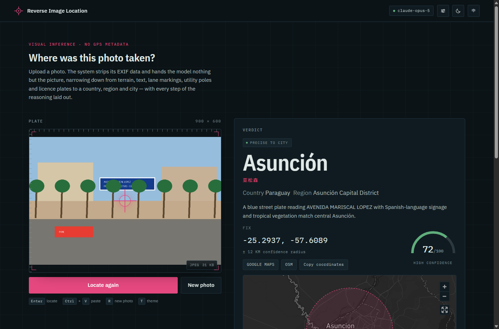

# Reverse Image Location

**Upload a photo — a vision model infers where on Earth it was taken, from the pixels alone.**

English | [简体中文](README.zh-CN.md)

[](https://github.com/Beluga-T/photo-locator/releases/latest)
[](LICENSE)
[](https://github.com/Beluga-T/photo-locator/actions/workflows/release.yml)



It returns coordinates, a confidence radius, and a full "observation → implication" evidence chain — terrain, architecture, road markings, signage, license plates, shadows.

## Features

- **Pixels only** — EXIF (including GPS) is stripped before anything reaches the model; the verdict is genuine visual inference, never metadata reading.
- **Evidence chain, precision discipline** — 4–8 reasoned evidence items; it answers only at the level the evidence supports (country → region → city → neighborhood) and never invents a city.
- **Live streaming** — place names, coordinates, and evidence render the moment the model writes them.
- **Bilingual UI** — English / 中文, one click, no reload.
- **Your provider, your key** — choose Claude (Anthropic) or any OpenAI-compatible gateway; the key is pasted once in the settings sheet and stored only on your machine.
- **Interactive map** — Mapbox with an uncertainty circle, or a built-in offline globe with zero external requests.
- **Portable desktop builds** — Windows / macOS / Linux, no Python needed; deleting the folder is the uninstall.
- **Docker ready** — prebuilt multi-arch image, hardened compose file.

## Download & run

Grab the build for your OS from the [latest release](https://github.com/Beluga-T/photo-locator/releases/latest) — nothing to install:

| Platform | Asset |
| --- | --- |
| Windows x64 | `photo-locator-<version>-windows-x64.zip` |
| macOS Apple Silicon | `photo-locator-<version>-macos-arm64.zip` |
| macOS Intel | `photo-locator-<version>-macos-x64.zip` |
| Linux x64 | `photo-locator-<version>-linux-x64.tar.gz` |

<details>
<summary><b>Windows</b></summary>

Extract the zip first, then run `photo-locator.exe`. SmartScreen shows "Windows protected your PC" because the build is unsigned — click **More info → Run anyway** (once per build). [Details](docs/MANUAL.md#windows)

</details>

<details>
<summary><b>macOS</b></summary>

Unzip, then **right-click → Open → Open** — the build is unsigned, so a plain double-click is refused the first time. On macOS 15+: System Settings → Privacy & Security → **Open Anyway**. [Details](docs/MANUAL.md#macos)

</details>

<details>
<summary><b>Linux</b></summary>

`tar -xzf photo-locator-*-linux-x64.tar.gz`, then run `./photo-locator` inside. Needs glibc 2.39+ (Ubuntu 24.04+); on older distros use source or Docker. [Details](docs/MANUAL.md#linux)

</details>

**First run**: your browser opens at `http://127.0.0.1:8000/`. Click the gear (top right), **choose a provider** — Claude (Anthropic) or an OpenAI-compatible gateway — paste that provider's API key, "Save & apply". No provider is preselected and no key is bundled.

### From source

```bash
git clone https://github.com/Beluga-T/photo-locator.git
cd photo-locator
python run.py   # Python 3.11+; builds .venv, installs deps, opens the browser
```

### Docker

```bash
docker run -d --name photo-locator -p 127.0.0.1:8000:8000 -v photo-locator-data:/data ghcr.io/beluga-t/photo-locator:latest
```

> **Keep it on 127.0.0.1.** The port has **no authentication** — anyone who can reach it can spend your key and read your analyzed photos. Before exposing anything, read the manual's [Security boundary](docs/MANUAL.md#security-boundary).

## Documentation

The full manual lives in [docs/MANUAL.md](docs/MANUAL.md) ([中文](docs/MANUAL.zh-CN.md)):

| Topic | Link |
| --- | --- |
| How it works, precision discipline | [How it works](docs/MANUAL.md#how-it-works) · [Precision discipline](docs/MANUAL.md#precision-discipline) |
| Running it in depth (build, `run.py`, venv, Docker) | [Download and run](docs/MANUAL.md#download-and-run-no-python-needed) · [Four ways to run it](docs/MANUAL.md#four-ways-to-run-it) |
| Configuration (`.env`, settings sheet, per-request headers) | [Configuration](docs/MANUAL.md#configuration) |
| API reference & error codes | [API reference](docs/MANUAL.md#api-reference) · [Error codes](docs/MANUAL.md#error-codes) |
| Data storage & privacy | [What the server stores](docs/MANUAL.md#what-the-server-stores-data) · [Scope and privacy](docs/MANUAL.md#scope-and-privacy) |
| Security boundary | [Security boundary](docs/MANUAL.md#security-boundary) |

## License

MIT — see [LICENSE](LICENSE). Third-party components (Mapbox GL JS, Motion, IBM Plex fonts, Python dependencies) carry their own licenses — see the [third-party notice](docs/MANUAL.md#license).
