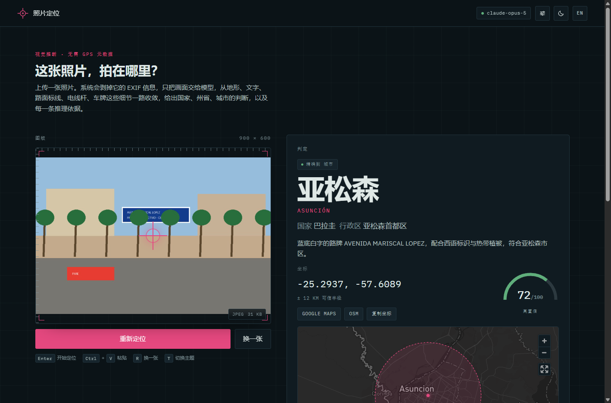

# 照片定位 · Reverse Image Location

**上传一张照片——视觉模型只看画面，推断它拍摄于世界上的哪个地方。**

[English](README.md) | 简体中文

[](https://github.com/Beluga-T/photo-locator/releases/latest)
[](LICENSE)
[](https://github.com/Beluga-T/photo-locator/actions/workflows/release.yml)



它返回坐标、可信半径和一整条「观察 → 推论」证据链——地形、建筑、道路标线、招牌文字、车牌、影子方向。

## 特性

- **只看像素**——EXIF（含 GPS）在进模型之前就被剥掉；结论是真正的视觉推断，不是读元数据。
- **证据链与精度纪律**——4–8 条有理有据的证据；只在证据支持的层级作答（国家 → 省 → 城市 → 街区），绝不编造城市。
- **实时流式输出**——地名、坐标、证据在模型写出的那一刻就上屏。
- **双语界面**——中文 / English，一键切换，无需刷新。
- **模型来源自选、密钥自备**——选 Claude（Anthropic）或任意 OpenAI 兼容网关；密钥在设置卡里粘一次，只存在你自己的机器上。
- **交互地图**——带不确定半径圈的 Mapbox 地图，或零外部请求的内置示意地球。
- **桌面便携构建**——Windows / macOS / Linux，不需要 Python；删掉文件夹就是卸载。
- **支持 Docker**——预构建多架构镜像，加固过的 compose 文件。

## 下载与运行

从[最新 Release](https://github.com/Beluga-T/photo-locator/releases/latest) 挑你系统对应的构建——什么都不用装：

| 平台 | 资产 |
| --- | --- |
| Windows x64 | `photo-locator-<version>-windows-x64.zip` |
| macOS Apple Silicon | `photo-locator-<version>-macos-arm64.zip` |
| macOS Intel | `photo-locator-<version>-macos-x64.zip` |
| Linux x64 | `photo-locator-<version>-linux-x64.tar.gz` |

<details>
<summary><b>Windows</b></summary>

先解压，再运行 `photo-locator.exe`。构建没有签名，SmartScreen 会弹出「Windows 已保护你的电脑」——点**更多信息 → 仍要运行**（每个构建只问一次）。[详细说明](docs/MANUAL.zh-CN.md#windows)

</details>

<details>
<summary><b>macOS</b></summary>

解压后**右键 → 打开 → 打开**——构建没有签名，第一次直接双击会被拒绝。macOS 15 及以上：系统设置 → 隐私与安全性 → **仍要打开**。[详细说明](docs/MANUAL.zh-CN.md#macos)

</details>

<details>
<summary><b>Linux</b></summary>

`tar -xzf photo-locator-*-linux-x64.tar.gz`，进目录运行 `./photo-locator`。需要 glibc 2.39+（Ubuntu 24.04+）；更老的发行版请用源码或 Docker。[详细说明](docs/MANUAL.zh-CN.md#linux)

</details>

**第一次运行**：浏览器自动打开 `http://127.0.0.1:8000/`。点右上角齿轮，**先选一个模型来源**——Claude（Anthropic）或 OpenAI 兼容网关——再粘那一家的 API Key，「保存并生效」。不预选任何一家，也不内置任何密钥。

### 从源码运行

```bash
git clone https://github.com/Beluga-T/photo-locator.git
cd photo-locator
python run.py   # Python 3.11+；自动建 .venv、装依赖、开浏览器
```

### Docker

```bash
docker run -d --name photo-locator -p 127.0.0.1:8000:8000 -v photo-locator-data:/data ghcr.io/beluga-t/photo-locator:latest
```

> **只跑在 127.0.0.1 上。** 这个端口**没有任何鉴权**——能连上的人就能花你的密钥、看你分析过的照片。想开出去之前，先读手册的[安全边界](docs/MANUAL.zh-CN.md#安全边界)。

## 文档

完整手册在 [docs/MANUAL.zh-CN.md](docs/MANUAL.zh-CN.md)（[English](docs/MANUAL.md)）：

| 主题 | 链接 |
| --- | --- |
| 它怎么工作、精度纪律 | [它是怎么工作的](docs/MANUAL.zh-CN.md#它是怎么工作的) · [精度纪律](docs/MANUAL.zh-CN.md#精度纪律) |
| 各种启动方式的细节（构建、`run.py`、venv、Docker） | [下载即用](docs/MANUAL.zh-CN.md#下载即用不需要-python) · [启动的四种方式](docs/MANUAL.zh-CN.md#启动的四种方式) |
| 配置（`.env`、设置卡、逐请求头） | [配置](docs/MANUAL.zh-CN.md#配置) |
| 接口与错误码 | [接口](docs/MANUAL.zh-CN.md#接口) · [错误码](docs/MANUAL.zh-CN.md#错误码) |
| 数据存储与隐私 | [服务端存了什么](docs/MANUAL.zh-CN.md#服务端存了什么data) · [边界与隐私](docs/MANUAL.zh-CN.md#边界与隐私) |
| 安全边界 | [安全边界](docs/MANUAL.zh-CN.md#安全边界) |

## 许可

MIT——见 [LICENSE](LICENSE)。第三方组件（Mapbox GL JS、Motion、IBM Plex 字体、Python 依赖）各有其许可——见[第三方说明](docs/MANUAL.zh-CN.md#许可)。
